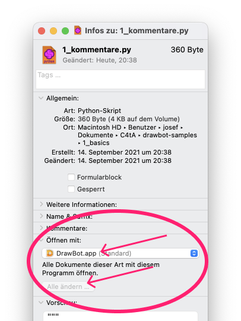

# DrawBot Beispiele

Eine Sammlung von Scripts für [DrawBot](https://drawbot.com) als Starthilfe für den ersten Tag.

## Download

- Finde und drücke oben rechts den grünen Knopf «Code», wähle die unterste Option «Download ZIP».
- Entpacke das Zip.
- Wähle im Finder eine einzelne Python-Datei (Endung `.py`) und öffne die Informationen: `cmd i`` (siehe Bild)
- Klicke auf *Öffnen mit* und wähle **DrawBot.app».
- Klicke auf **Alle ändern**
- Jetzt kannst du loslegen.

## Ziel

- Du kannst DrawBot ausprobieren, auch wenn du noch keine Erfahrung mit Programmierung hast.
- Wenn du schon programmiert hast, aber keine Erfahrung mit Python hast, kannst du dich mit der Python-Syntax vertraut machen.

## Inhalt

1. **Basics**: Grundlegende Programm-Bausteine wie Variablen und Funktionen.
2. **Positionierung**: Zurechtfinden im Koordinatensystem
3. **Zufall**: Die Funktion `random()` und mögliche Anwendung
4. **Loop**: wiederholtes Ausführen eines Programmabschnitts mit dem `for … in …` Statement
5. **if/else**: Ausführen eines Programmabschnitts nur wenn eine Bedingung gegeben ist
6. **Kombinationen**: Zusammenspiel von Zufall, Loops und Bedingungen
7. **Funktionen**: Was ist das und wie kannst du Eigene herstellen?
8. **Text**: Ein einziges Beispiel mit Text statt Grundformen

## TL;DR

Wenn du schon etwas Erfahrung mit DrawBot hast,  beginne direkt mit dem Ordner `6_kombinationen`.